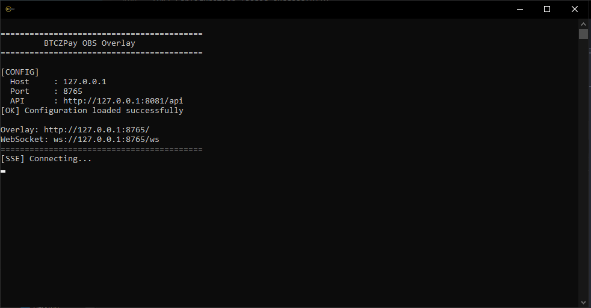
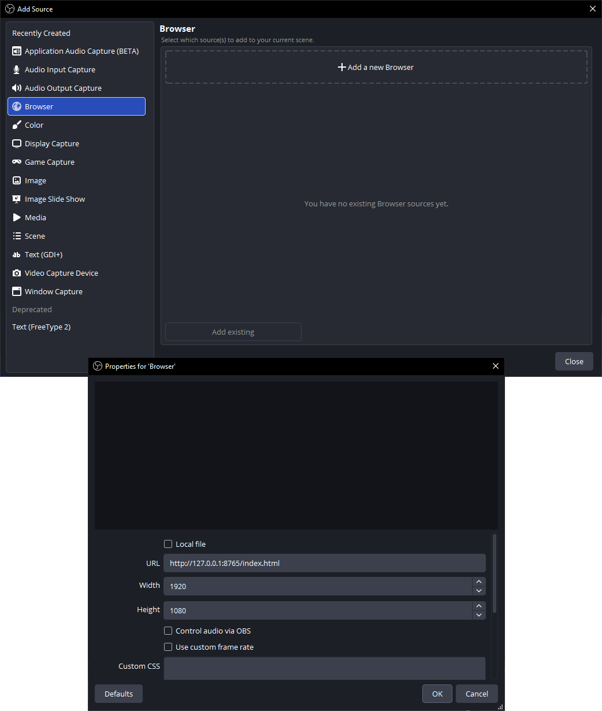

# BTCZPay Overlay

Real-time donation alerts for streamers using **BTCZPay**.

BTCZPay Overlay connects to the BTCZPay event stream and displays incoming donation notifications directly in your stream through **OBS Studio**.

When a donation is received, the overlay automatically receives the event and displays information such as:

- Social provider
- Donor name
- Donation message
- Donation amount
- Currency

The overlay runs locally on your computer and communicates with BTCZPay through **SSE (Server-Sent Events)** and with the browser overlay through **WebSocket**.

---

## Features

- Real-time donation notifications
- BTCZPay SSE integration
- WebSocket communication with the browser overlay
- OBS Browser Source support
- Social provider information
- Donor name and message
- Donation amount and currency
- Lightweight local application
- Configurable API endpoint
- Secure API key input
- Automatic SSE reconnection
- Works independently from OBS

---

## How It Works

BTCZPay Overlay uses two connections:

```text
                     BTCZPay Server
                           │
                           │ SSE
                           ▼
                  ┌─────────────────┐
                  │  BTCZPay Overlay│
                  │   Local App     │
                  └────────┬────────┘
                           │
                           │ WebSocket
                           ▼
                  ┌─────────────────┐
                  │ Browser Overlay │
                  │    /ws          │
                  └────────┬────────┘
                           │
                           ▼
                     OBS Studio
```

When a new invoice status event is received:

1. The overlay connects to the BTCZPay SSE endpoint.
2. BTCZPay sends a `new_invoice_status` event.
3. The overlay extracts the invoice ID.
4. The overlay requests the invoice information from BTCZPay.
5. If the invoice contains a social donation request, the data is sent to connected browsers through WebSocket.
6. The browser overlay displays the donation notification.
7. OBS captures the browser overlay through a Browser Source.

---

# Requirements

## Software

You need:

- Python 3.10+
- `briefcase` `aiohttp`
- OBS Studio
- A BTCZPay account/profile
- A BTCZPay API key

---

# Installation

Clone the repository:

```bash
git clone https://github.com/SpaceZ-Projects/btczpayoverlay.git
cd btczpayoverlay
```

Install dependencies:

```bash
pip install -r requirements.txt
```

---

# Configuration

The application can use a `config.json` file.

Example:

```json
{
    "server": {
        "host": "127.0.0.1",
        "port": 8765,
        "api": "https://pay.btcz.rocks/api",
        "key": "YOUR_API_KEY"
    }
}
```

## Configuration Options

| Option | Description |
|---|---|
| `host` | Local address where the overlay server listens |
| `port` | Local port used by the overlay |
| `api` | BTCZPay API endpoint |
| `key` | BTCZPay API key |

### Host

For normal local usage:

```json
"host": "127.0.0.1"
```

### Port

The default port is:

```json
"port": 8765
```

### API Endpoint

Set this to your BTCZPay API endpoint:

```json
"api": "https://pay.btcz.rocks/api"
```

### API Key

Your BTCZPay API key is required to receive authenticated events.

```json
"key": "YOUR_API_KEY"
```

**Do not publish your API key on GitHub.**

If `api` or `key` is missing from `config.json`, the application will ask you to enter them when it starts.
The API key is entered securely using a hidden password prompt.

---

# Starting the Overlay



Run:

```bash
briefcase dev
```

You should see something similar to:

```text
==========================================
         BTCZPay OBS Overlay
==========================================

[CONFIG]
  Host     : 127.0.0.1
  Port     : 8765
  API      : https://pay.btcz.rocks/api
[OK] Configuration loaded successfully

Overlay: http://127.0.0.1:8765/
WebSocket: ws://127.0.0.1:8765/ws
==========================================
[SSE] Connecting...
```

The application is now waiting for BTCZPay events.

---

# OBS Studio Setup



After starting BTCZPay Overlay, open **OBS Studio**.

## 1. Add a Browser Source

In OBS:

```text
Sources
   ↓
+
   ↓
Browser
```

Create a new Browser Source.

For example:

```text
Name:
BTCZPay Overlay
```

---

## 2. Set the URL

Use the local overlay URL:

```text
http://127.0.0.1:8765/index.html
```

---

## 3. Set the Size

Set the Browser Source resolution to match your stream.

The overlay itself uses a transparent background, so it can be placed over your existing stream layout.

---

# Testing

You can test the overlay by making a donation through your BTCZPay profile.
When the payment is detected, the application should receive the BTCZPay event.
The terminal should display something similar to:

```text
Provider : twitch
Name : ExampleUser
Message : Thanks for the stream!
Amount : 1000 BTCZ
================================
```

The same donation data is then sent to the browser overlay through WebSocket.

---

# Donation Data

The overlay receives social donation information such as:

```json
{
    "provider": "twitch",
    "name": "ExampleUser",
    "message": "Thanks for the stream!",
    "amount": 1000,
    "currency": "BTCZ"
}
```

This information is sent to the browser through WebSocket:

```json
{
    "data": {
        "provider": "twitch",
        "name": "ExampleUser",
        "message": "Thanks for the stream!",
        "amount": 1000,
        "currency": "BTCZ"
    }
}
```

---

# WebSocket

The local WebSocket server is available at:

```text
ws://127.0.0.1:8765/ws
```

The browser overlay connects to this endpoint and waits for donation events.
When a donation arrives, the application broadcasts the event to all connected WebSocket clients.
This allows multiple browser sources or local clients to receive the same notification.

---

# SSE Connection

BTCZPay Overlay listens for real-time events using Server-Sent Events.
The application connects to:

```text
https://pay.btcz.rocks/api/user/events
```

with authentication:

```http
Authorization: Bearer YOUR_API_KEY
Accept: text/event-stream
```

The connection remains open while the application is running.
If the connection is interrupted, the application automatically attempts to reconnect.

Example:

```text
[SSE] Connecting...
[SSE] Connection closed by server
[SSE] Reconnecting...
[SSE] Connecting...
```

---

# Recommended Project Structure

A typical installation looks like:

```text
btczpayoverlay/
├── __main__.py
├── app.py
├── config.json
├── faveicon.ico
└── www/
    ├── index.html
    └── static/
        ├── overlay.js
        ├── style.css
        └── Monda.ttf
    
```

The `www/` directory contains the web overlay displayed by OBS.

---

# Contributing

Contributions, bug reports, and improvements are welcome.

If you find a bug, please open an issue with:

- Operating system
- Python version
- Error message
- Relevant application logs
- Steps to reproduce the problem

Please **never include your API key** in an issue or pull request.